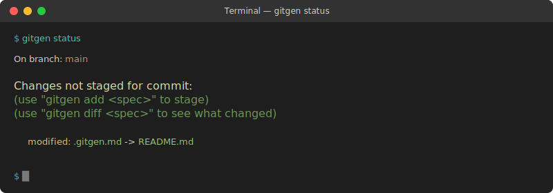

# gitgen

[](https://github.com/gitgen/gitgen/actions/workflows/ci.yml)
[](https://www.npmjs.com/package/gitgen)
[](https://opensource.org/licenses/MIT)

**GitGen is a git-like MCP for predictive version control using `.gitgen.md` specs.**

Like git manages versions of files, gitgen manages **predicted versions** of files. The natural I/O is git-like operations - checkout, diff, branch, status - but operating on predicted/generated content rather than committed history.

<p align="center">
  
</p>

## The Concept

```bash
git checkout feature/add-auth     # Checks out existing branch
gitgen checkout feature/add-auth  # Predicts what this branch WOULD contain
```

The `.gitgen.md` files become the "specs" that define what content should exist. GitGen predicts file contents based on:
1. The .gitgen.md spec (the "what should be generated")
2. Current codebase context (the "what exists now")
3. Git history (the "how things evolved")
4. Cascading inheritance (the "conventions to follow")

## Installation

```bash
npm install -g gitgen
```

**Requirements:**
- Node.js >= 20.0.0
- `ANTHROPIC_API_KEY` environment variable (for content generation)

## Quick Start

```bash
# Initialize a gitgen repository
gitgen init

# Check status of .gitgen.md specs
gitgen status

# Create a spec for an existing file
gitgen add README.md --description "Project documentation"

# See what would be generated (preview diff)
gitgen diff README.gitgen.md --dry-run

# Generate the content (requires ANTHROPIC_API_KEY)
gitgen diff README.gitgen.md

# Stage and commit (regenerate all staged specs)
gitgen add README.gitgen.md
gitgen commit -m "Update README"
```

## Commands

| Command | Description |
|---------|-------------|
| `gitgen init` | Initialize `.gitgen/` directory |
| `gitgen status` | Show status of specs |
| `gitgen diff <spec>` | Show predicted diff |
| `gitgen add <file>` | Create or stage spec |
| `gitgen commit` | Regenerate staged specs |
| `gitgen watch` | Auto-regenerate on changes |
| `gitgen cascade <spec>` | Show inheritance chain |
| `gitgen validate` | Validate specs without API |

### `gitgen init [path]`
Initialize a gitgen repository by creating the `.gitgen/` directory.

```bash
gitgen init
gitgen init ./my-project
```

### `gitgen status`
Show status of `.gitgen.md` specs - which need regeneration, which are up to date.

```bash
gitgen status
gitgen status --json
```

Output shows:
- **staged**: Specs ready for commit
- **modified**: Specs that changed since last generation
- **new**: Specs with missing output files

### `gitgen diff <spec>`
Show difference between current file and predicted content from spec.

```bash
# Generate prediction and show diff (calls Anthropic API)
gitgen diff README.gitgen.md

# Include git context in prediction
gitgen diff README.gitgen.md --git

# Preview without API call
gitgen diff README.gitgen.md --dry-run

# Use cached prediction
gitgen diff README.gitgen.md --cached
```

### `gitgen add <file>`
Create a `.gitgen.md` spec for an existing file, or stage an existing spec for commit.

```bash
# Create spec for existing file
gitgen add README.md --description "Project documentation"

# Stage an existing spec
gitgen add README.gitgen.md
```

### `gitgen commit`
Regenerate all staged specs and write output files.

```bash
gitgen commit -m "Update documentation"
gitgen commit --git          # Include git context
gitgen commit --dry-run      # Preview without writing
```

### `gitgen watch`
Watch `.gitgen.md` files and auto-regenerate on change.

```bash
gitgen watch
gitgen watch --git           # Include git context
gitgen watch --initial       # Run initial generation
gitgen watch --debounce 1000 # Custom debounce time
```

### `gitgen cascade <spec>`
Show the inheritance chain for a `.gitgen.md` spec.

```bash
gitgen cascade README.gitgen.md
gitgen cascade README.gitgen.md --full  # Show full content
gitgen cascade README.gitgen.md --json  # JSON output
```

### `gitgen validate [path]`
Validate `.gitgen.md` specs without making API calls.

```bash
gitgen validate              # Validate all specs
gitgen validate README.gitgen.md  # Validate single spec
gitgen validate --json       # JSON output
```

## The `.gitgen.md` File Format

A `.gitgen.md` file is a markdown file with YAML frontmatter:

```markdown
---
name: "README Generator"
description: "Generate project documentation"
context:
  - "./package.json"
  - "./src/index.ts"
skills:
  - "./.agent/skills/readme.md"
output: "README.md"
---

Generate comprehensive documentation for this project.

Include:
- Project description
- Installation instructions
- Usage examples
- API documentation
```

**Frontmatter Fields:**
| Field | Description |
|-------|-------------|
| `name` | Human-readable identifier |
| `description` | What gets generated |
| `context` | File paths to include as context |
| `skills` | Skill files for domain knowledge |
| `output` | Target output filename |

## Skills

Skills are markdown files that provide domain-specific knowledge to the generation:

```yaml
skills:
  - "./.agent/skills/readme.md"
  - "./.agent/skills/api-docs.md"
```

- Skills are loaded and injected into the prompt
- Name is extracted from the first H1 heading
- Use for coding guidelines, API documentation, or any domain knowledge

## The `.gitgen/` Directory

GitGen maintains state in a `.gitgen/` directory (like `.git/`):

```
.gitgen/
├── HEAD                      # Current branch
├── config                    # Configuration
├── index                     # Staged specs
├── refs/heads/               # Branches
├── objects/                  # Cached predictions
└── logs/                     # Generation history
```

## Cascading Configuration

Place a `.gitgen.md` file in any directory to define defaults that cascade to all generators in subdirectories:

```
project/
  .gitgen.md                  # Root config
  packages/
    .gitgen.md                # Package defaults
    cli/
      app.gitgen.md           # Inherits from both
```

**Merge Rules:**
- Scalar values: child overrides parent
- Arrays (context, skills): concatenate and deduplicate
- Body: append child to parent

## Extensibility

The system supports:
- **Custom LLM providers** - Add OpenAI, local models, etc. via extensions
- **Custom prompt sections** - Inject additional context with priority ordering
- **Pre/post hooks** - Process content before/after generation
- **Prompt overrides** - Place custom prompts in `.gitgen/prompts/` to override defaults

Sample extensions in `extensions/`:
- `code-review/` - Adds code review guidelines to generated code
- `openai-provider/` - Adds OpenAI as an alternative LLM provider

## MCP Server

GitGen includes an MCP server for AI agent integration:

```bash
# Start the MCP server
gitgen mcp
```

**Available Tools:**
| Tool | Description |
|------|-------------|
| `gitgen_init` | Initialize repository |
| `gitgen_status` | Show spec status |
| `gitgen_diff` | Show predicted diff |
| `gitgen_add` | Create/stage specs |
| `gitgen_commit` | Regenerate and write |
| `gitgen_validate` | Validate specs |
| `gitgen_cascade` | Show inheritance chain |

**Available Resources:**
- `gitgen://spec/<path>` - Read spec contents with resolved cascade

Configure in your MCP client:
```json
{
  "mcpServers": {
    "gitgen": {
      "command": "gitgen",
      "args": ["mcp"]
    }
  }
}
```

## GitHub Actions

GitGen includes CI/CD workflows:

- **CI** - Runs on every push/PR: typecheck, lint, build, test
- **Release** - Publishes to npm on version tags
- **PR Check** - Validates specs, reviews dependencies

```yaml
# Example: Add gitgen validation to your workflow
- name: Validate specs
  run: |
    gitgen init
    gitgen validate
```

## Example Workflow

```bash
# Initialize
gitgen init

# Create a spec for your README
gitgen add README.md --description "Project documentation"

# Edit the generated spec to add more instructions
# (the .gitgen.md file was created)

# Validate the spec
gitgen validate README.gitgen.md

# Preview what would be generated
gitgen diff README.gitgen.md --dry-run

# Generate the content
gitgen diff README.gitgen.md

# Commit the generation
gitgen add README.gitgen.md
gitgen commit -m "Generate initial README"
```

## Contributing

1. Fork the repository
2. Create a feature branch
3. Make your changes
4. Run tests: `npm test`
5. Submit a pull request

See [PULL_REQUEST_TEMPLATE.md](.github/PULL_REQUEST_TEMPLATE.md) for PR guidelines.

## Environment Variables

| Variable | Description |
|----------|-------------|
| `ANTHROPIC_API_KEY` | Required for content generation |

## License

MIT
